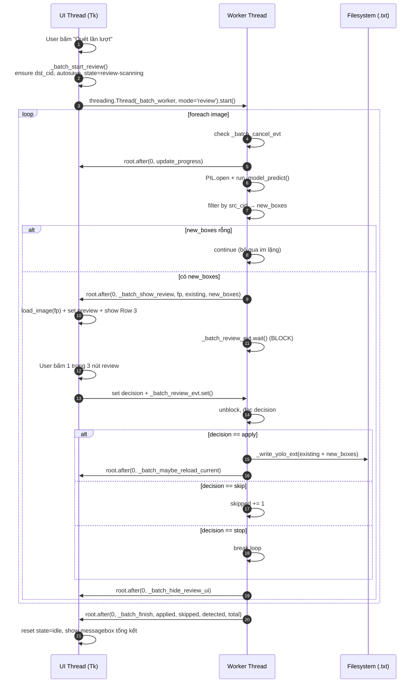

# Technical Design Doc — Bổ sung class hàng loạt (Batch Add Class)

## 1. Bối cảnh

- Link PLAN: `.claude/plans/PLAN-bbox-batch-add-class-2026-07-08.md`
- User story rút gọn (đã chốt qua AskUserQuestion): trong tab BBox Editor v1, user chọn 1 model detect đã load + 1 class nguồn (theo bảng `.names` của model), sau đó duyệt toàn bộ thư mục ảnh và APPEND các box được model detect (đã lọc đúng class nguồn) vào file YOLO `.txt` hiện có — nhãn cũ giữ nguyên, không phá tính năng detect đơn ảnh.
- 2 chế độ quét:
  - **Auto** (`🔍 Quét toàn bộ`): chạy nền hết toàn bộ ảnh, ghi thẳng vào `.txt` từng ảnh, cuối cùng báo tổng kết.
  - **Review** (`🔍 Quét lần lượt`): dừng lại ở MỖI ảnh có box mới, vẽ preview (màu khác) lên canvas chính, chờ user bấm 1 trong 3 nút review (`✅ Áp dụng & tiếp theo` / `⏭ Bỏ qua` / `⏹ Dừng`). Ảnh không có box mới → tự động bỏ qua.

## 2. Goals / Non-goals

### Goals
- Append box mới vào label YOLO `.txt` mà không xoá box cũ.
- Tái dùng tối đa model đã load ở khối Detect hiện có (`self._det_model`), pattern threading `_run_detect`/`_load_det_model`, `run_model_predict()`, `_read_yolo`/`_write_yolo`.
- Chế độ Review vẽ preview lên canvas chính bằng lớp overlay tạm, KHÔNG trộn vào `self._bboxes` cho tới khi user bấm Áp dụng.
- Nếu tên label đích chưa có trong `self.label_list` → tự append + refresh mọi combobox tham chiếu.
- Nếu ảnh hiện tại đang mở nằm trong batch và vừa được ghi → reload đúng bằng `_load_image(current_idx)`.

### Non-goals
- KHÔNG áp dụng IoU dedup ở phiên bản đầu (ghi TODO trong code).
- KHÔNG sửa `tab_bbox2.py`, không refactor sang `label_io.py`.
- KHÔNG hỗ trợ model không expose `.names` (xem quyết định (b)).

## 3. Quyết định thiết kế (a)–(i)

### (a) Model slot — DÙNG CHUNG `self._det_model` (KHÔNG tạo slot riêng)

Tái dùng hoàn toàn `self._det_model`, `self._det_model_type`, `self._det_model_names`, `self._det_conf_var`, cơ chế load bất đồng bộ `_load_det_model` / `_auto_load_det_model` / `_on_det_model_loaded` đã có.

**Lý do:**
- User luôn phải chọn model trước khi Detect đơn ảnh → model batch phải là chính model đó, tránh confusion "đang detect 1 ảnh bằng model A nhưng batch bằng model B".
- Tránh nhân đôi state (2 model trong RAM cùng lúc, đặc biệt nặng với model ONNX/RF-DETR).
- Khối UI batch chỉ cần đọc `self._det_model_names` để đổ vào dropdown class nguồn. Khi user đổi model → callback `_on_det_model_loaded` có sẵn sẽ refresh cả dropdown Detect và dropdown batch (thêm dòng gọi `self._refresh_batch_class_combo()` vào cuối hàm này).

### (b) Cách lấy `.names` để đổ vào dropdown class nguồn

| Loại model | Có `.names`? | Nguồn | Ghi chú |
|---|---|---|---|
| YOLO (Ultralytics `.pt`) | ✅ Có | `dict(mdl.names)` — đã đọc sẵn trong `_auto_load_det_model` | `{0: 'person', 1: 'bicycle', ...}` |
| RF-DETR (`.pt`) | ⚠️ Có thể | `mdl.model.names` (list hoặc dict) — đã đọc sẵn | Có thể trống nếu weight custom |
| ONNX (`_OnnxRunner`) | ❌ KHÔNG | `runner.names = {}` (hard-code rỗng, xem `yolo_onnx.py:32`) | Không có metadata class |

**Quyết định:** Tính năng batch add class **chỉ bật khi `self._det_model_names` không rỗng**. Cụ thể:

- Dropdown class nguồn được refresh trong `_refresh_batch_class_combo()`.
- Nếu `len(self._det_model_names) > 0` → đổ list `[f"{cid}: {name}" for cid, name in sorted(self._det_model_names.items())]`, enable 2 nút "Quét toàn bộ" / "Quét lần lượt".
- Nếu rỗng → dropdown = `["(model không có .names — dùng YOLO/.pt để dùng batch)"]` state readonly, disable 2 nút quét. Status label ghi rõ lý do.
- **Không cho phép user nhập tay class_id** ở bản đầu — đơn giản hoá UX, tránh sai lệch class_id giữa các model. Có thể mở sau nếu user yêu cầu.

### (c) Vị trí UI — thêm 1 `LabelFrame` mới trong khối `center`

**Vị trí trong layout:** ngay SAU `rl_tb` (Batch Relabel toolbar, dòng ~594-621), TRƯỚC `self._attr_bar` (dòng ~624). Đây là vị trí hợp lý vì cùng nhóm "thao tác batch" với Đổi nhãn.

**Cấu trúc:**

```
LabelFrame "➕ Bổ sung class hàng loạt" (bg=CARD, fg=ACCENT2, font=F_BOLD)
├── Row 1 (chọn class + label đích + 2 nút chế độ):
│   ├── Label "Class nguồn (từ model):"
│   ├── Combobox self._batch_src_class_combo (readonly, values từ model.names)
│   ├── Label "→ Nhãn đích:"
│   ├── Entry self._batch_dst_label_var (StringVar, cho user gõ tên nhãn đích)
│   ├── Button "🔍 Quét toàn bộ" → self._batch_start_auto
│   ├── Button "🔍 Quét lần lượt" → self._batch_start_review
│   └── Button "⏹ Dừng" (ẩn ban đầu, hiện khi batch đang chạy) → self._batch_stop
├── Row 2 (progress + status):
│   ├── ttk.Progressbar self._batch_pb (K.Horizontal.TProgressbar, maximum=100)
│   └── Label self._batch_status_lbl (text="", fg=DIM)
└── Row 3 (nút review — CHỈ hiện ở chế độ Review khi đang chờ user quyết định):
    ├── Button "✅ Áp dụng & tiếp theo" (bg="#2e7d32") → self._batch_review_apply
    ├── Button "⏭ Bỏ qua" (bg=ACCENT2) → self._batch_review_skip
    └── (Nút "⏹ Dừng" ở Row 1 dùng chung cho cả 2 chế độ)
```

Row 3 dùng `frame.pack_forget()` / `frame.pack()` để ẩn/hiện. Ban đầu ẩn — chỉ hiện khi thread nền báo lên "đang chờ user quyết định ảnh này".

State machine (biến `self._batch_state`):
- `"idle"` — không quét, 2 nút bấm "Quét toàn bộ"/"Quét lần lượt" enable, "⏹ Dừng" ẩn, Row 3 ẩn.
- `"auto"` — đang chạy Auto, 2 nút quét disable, "⏹ Dừng" hiện, Row 3 ẩn.
- `"review-scanning"` — đang detect ảnh kế tiếp trong chế độ Review, 2 nút quét disable, "⏹ Dừng" hiện, Row 3 ẩn.
- `"review-waiting"` — thread nền đang chờ user quyết định, Row 3 hiện với 2 nút Áp dụng/Bỏ qua, "⏹ Dừng" vẫn hiện.

### (d) Luồng threading

Cả 2 chế độ dùng 1 thread nền duy nhất chạy vòng `for real_idx, fp in enumerate(self.image_files)`, gọi `run_model_predict(...)` trên từng ảnh (mở PIL trực tiếp trong thread nền — model đã thread-safe cho inference đơn ảnh, `_run_detect` hiện có cũng chạy pattern y hệt).

**Đồng bộ với UI thread:**
- `self._batch_cancel_evt = threading.Event()` — main thread `set()` khi user bấm "⏹ Dừng"; thread nền check trước mỗi ảnh, `break` khi set.
- `self._batch_review_evt = threading.Event()` — thread nền `wait()` sau khi detect ra 1 ảnh có box mới ở chế độ Review; main thread `set()` khi user bấm Áp dụng/Bỏ qua/Dừng.
- `self._batch_review_decision` = `"apply"` | `"skip"` | `"stop"` — main thread ghi trước khi `set()` Event; thread nền đọc sau khi `wait()`.
- Mọi update UI (progress bar, status label, hiện/ẩn Row 3, vẽ preview canvas) phải gọi qua `self.root.after(0, ...)` — theo đúng pattern `_run_detect`/`_load_det_model` hiện có. TUYỆT ĐỐI KHÔNG động vào canvas/widget trực tiếp từ thread nền.

**Pseudocode thread nền (dùng chung cả 2 chế độ):**

```python
def _batch_worker(self, mode: str, src_cid: int, dst_label: str):
    """Chạy trong daemon thread. mode ∈ {'auto', 'review'}."""
    total = len(self.image_files)
    applied = skipped = detected = 0

    # (1) Đảm bảo class_id đích tồn tại — làm trên UI thread trước khi worker chạy
    #     (xem (f)). Worker chỉ đọc self._batch_dst_cid (đã set sẵn).
    dst_cid = self._batch_dst_cid

    for i, fp in enumerate(self.image_files):
        if self._batch_cancel_evt.is_set():
            break
        self.root.after(0, self._batch_update_progress, i, total, fp.name)

        # (2) Detect ảnh này
        try:
            from PIL import Image
            pil = Image.open(fp).convert("RGB")
            iw, ih = pil.size
            boxes = run_model_predict(
                self._det_model, self._det_model_type, pil, self._det_conf_var.get())
        except Exception as e:
            # log lỗi ảnh này, tiếp tục ảnh sau
            continue

        # (3) Lọc đúng class nguồn
        new_boxes = [(dst_cid, x1, y1, x2, y2)      # class_id đã ĐỔI sang dst_cid
                     for cid, x1, y1, x2, y2, _sc in boxes if cid == src_cid]
        if not new_boxes:
            continue  # cả 2 chế độ: ảnh không có box mới → bỏ qua im lặng
        detected += 1

        # (4) Đọc box cũ từ file .txt (nếu có)
        lbl_path = self._resolve_lbl_path(fp)
        existing = self._read_yolo_ext(lbl_path, iw, ih)  # xem (h)

        if mode == "auto":
            # (5a) Ghi thẳng append + reload nếu ảnh đang mở
            merged = existing + [list(b) for b in new_boxes]
            self._write_yolo_ext(lbl_path, merged, iw, ih)
            applied += 1
            self.root.after(0, self._batch_maybe_reload_current, fp)
        else:  # mode == "review"
            # (5b) Gửi preview lên UI thread, mở ảnh đó, chờ quyết định
            self.root.after(0, self._batch_show_review, fp, existing, new_boxes)
            self._batch_review_evt.clear()
            self._batch_review_evt.wait()   # BLOCK cho tới khi user bấm nút review
            if self._batch_cancel_evt.is_set() or self._batch_review_decision == "stop":
                break
            if self._batch_review_decision == "apply":
                merged = existing + [list(b) for b in new_boxes]
                self._write_yolo_ext(lbl_path, merged, iw, ih)
                applied += 1
                self.root.after(0, self._batch_maybe_reload_current, fp)
            else:  # "skip"
                skipped += 1
            self.root.after(0, self._batch_hide_review_ui)

    # (6) Kết thúc
    self.root.after(0, self._batch_finish, applied, skipped, detected, total)
```

**Chống deadlock:**
- `_batch_review_evt.wait()` không có timeout — nhưng luôn được `set()` ở đúng 1 trong 3 nút Review + nút Dừng (cả 4 nút đều gọi `self._batch_review_evt.set()`).
- Nút "⏹ Dừng" (Row 1) khi ấn: `_batch_cancel_evt.set()` + `_batch_review_decision = "stop"` + `_batch_review_evt.set()` → thread nền đang `wait()` sẽ unblock ngay, check cancel_evt và break.
- Nếu user đóng cửa sổ giữa chừng → `WM_DELETE_WINDOW` không được override thêm ở task này (BBoxEditorTab không phải Toplevel). Nhưng đảm bảo `_batch_worker` là daemon thread → app đóng thì thread tự chết.
- Trên UI thread, mọi callback từ `root.after(0, ...)` là short-lived (chỉ update label + hiện/ẩn frame) — không có nested `wait()` → không có deadlock giao nhau.

### (e) Vẽ preview không trộn vào `self._bboxes`

Thêm 2 biến state (init trong `__init__`):

```python
self._batch_preview_boxes  = []     # list [(dst_cid, x1, y1, x2, y2), ...] trong tọa độ ẢNH GỐC
self._batch_preview_active = False
```

Trong `_render()` (dòng ~1211-1250) — thêm 1 dòng gọi `self._draw_batch_preview_overlay()` sau `self._draw_zoomtest_overlay()`.

Trong `_redraw_bboxes_only()` (dòng ~1306-1313) — thêm `self._canvas.delete("batch_preview_item")` + `self._draw_batch_preview_overlay()`.

Hàm mới (giống `_draw_zoomtest_overlay` — pattern đã có sẵn, dòng ~3671-3692):

```python
def _draw_batch_preview_overlay(self):
    """Vẽ overlay preview (màu cam đứt nét) cho box mới do batch detect được.
    KHÔNG trộn vào self._bboxes — chỉ hiển thị đến khi user bấm Áp dụng/Bỏ qua."""
    if not self._batch_preview_active or self._pil_img is None:
        return
    lw = max(2, self._line_width_var.get() + 1)  # dày hơn 1px so với box thường
    color = "#F05922"                             # ACCENT cam — nổi bật
    for cid, x1, y1, x2, y2 in self._batch_preview_boxes:
        cx1 = int(x1 * self._scale) + self._off_x
        cy1 = int(y1 * self._scale) + self._off_y
        cx2 = int(x2 * self._scale) + self._off_x
        cy2 = int(y2 * self._scale) + self._off_y
        name = self.label_list[cid] if cid < len(self.label_list) else str(cid)
        txt  = f" ➕ {name} "
        tw   = max(len(txt) * 7, 30)
        self._canvas.create_rectangle(cx1, cy1, cx2, cy2,
            outline=color, width=lw, dash=(8, 4), tags="batch_preview_item")
        self._canvas.create_rectangle(cx1, cy1 - 17, cx1 + tw, cy1,
            fill=color, outline="", tags="batch_preview_item")
        self._canvas.create_text(cx1 + 3, cy1 - 8, text=txt, fill="white",
            font=("Segoe UI", 8, "bold"), anchor=W, tags="batch_preview_item")
```

`_batch_show_review(fp, existing, new_boxes)` (chạy UI thread) làm:
1. `self._autosave()` (lưu ảnh đang mở trước nếu dirty).
2. Gọi `self._load_image(real_idx_of_fp)` — reload đúng ảnh trong batch với `_bboxes = existing` (đọc lại từ .txt qua flow chuẩn).
3. `self._batch_preview_boxes = list(new_boxes)`; `self._batch_preview_active = True`.
4. `self._render()` — canvas hiện GT (existing màu thường) + preview (cam đứt nét).
5. `self._batch_review_frame.pack(...)` hiện Row 3.
6. `self._batch_state = "review-waiting"`.

`_batch_hide_review_ui()`:
1. `self._batch_preview_boxes = []`; `self._batch_preview_active = False`.
2. `self._canvas.delete("batch_preview_item")`.
3. `self._batch_review_frame.pack_forget()`.

### (f) Cập nhật `label_list` + refresh combobox

Ngay khi user bấm "Quét toàn bộ" / "Quét lần lượt" (UI thread, TRƯỚC khi start thread nền):

1. Đọc `dst_label = self._batch_dst_label_var.get().strip()`. Nếu rỗng → thông báo lỗi, không start.
2. Nếu `dst_label` đã có trong `self.label_list` → `dst_cid = self.label_list.index(dst_label)`.
3. Nếu chưa có → append vào `self.label_list`, `dst_cid = len(self.label_list) - 1`, GỌI helper `self._refresh_label_widgets()` (hàm mới, xem dưới) để đồng bộ:
   - `self._labels_var` = ",".join(self.label_list) (giữ config `bbox.labels` khớp).
   - `self._cls_lb` (Listbox class chính, dòng 402-407, 934-939) — clear + insert lại toàn bộ với màu palette.
   - `self._cls_combo["values"]` (Combobox class chính, dòng 485-486, 941).
   - `self._filter_label_combo["values"]` (Combobox filter theo nhãn, dòng 242, 954).
   - `self._rl_from_combo["values"]` + `self._rl_to_combo["values"]` (Batch Relabel, dòng 600-607, 945-950).
   - `self._must_have_lb` + `self._must_not_lb` (dòng 331-355, 967-974).
   - `self._batch_src_class_combo` KHÔNG đụng (dropdown class NGUỒN từ model, không phải label list).
4. Set `self._batch_dst_cid = dst_cid` (worker đọc biến này).

Việc refresh label widgets tách thành 1 hàm private mới để tái dùng — tránh copy-paste 7 chỗ update.

### (g) Reload ảnh đang mở

Sau MỖI lần ghi file `.txt` trong worker (cả 2 chế độ), gọi `self.root.after(0, self._batch_maybe_reload_current, fp)`:

```python
def _batch_maybe_reload_current(self, fp: Path):
    """Nếu ảnh vừa ghi là ảnh đang mở → reload để self._bboxes khớp file mới."""
    if self.current_idx < 0:
        return
    if self.image_files[self.current_idx] == fp:
        # KHÔNG gọi self._autosave() ở đây — nếu ảnh đang mở dirty thì save lúc này
        # sẽ ghi ĐÈ box vừa append của batch. Ta chọn ưu tiên batch (đã ghi xong)
        # → discard modification chưa lưu trong ảnh đang mở, reload lại từ đĩa.
        self._modified = False
        self._load_image(self.current_idx)
```

**Lưu ý quan trọng — race condition với `_autosave`:**
- Khi user bấm "Quét toàn bộ", ảnh đang mở CÓ THỂ đang dirty (`_modified = True`). Trong UI handler trước khi start worker, PHẢI gọi `self._autosave()` để lưu changes chưa commit — tránh mất dữ liệu.
- Ở chế độ Review, `_batch_show_review` cũng gọi `_autosave()` trước khi `_load_image(fp)` để không mất changes ảnh trước.

### (h) Hàm/method mới cần thêm (chốt tên, Senior Dev PHẢI theo)

| Method | Signature | Nơi gọi | Mô tả ngắn |
|---|---|---|---|
| `_build_batch_add_class_ui(self, parent)` | `→ None` | trong `_build`, sau `rl_tb` | Tạo LabelFrame + widgets, gán biến state. |
| `_refresh_batch_class_combo(self)` | `→ None` | Cuối `_on_det_model_loaded` + sau `_build_batch_add_class_ui` | Đổ lại `self._batch_src_class_combo["values"]` từ `self._det_model_names`, enable/disable 2 nút quét. |
| `_refresh_label_widgets(self)` | `→ None` | Sau khi append `self.label_list` (f), có thể tái dùng ở nơi khác nếu thấy phù hợp | Đồng bộ mọi combobox/listbox tham chiếu `label_list`. |
| `_batch_start_auto(self)` | `→ None` | Button `🔍 Quét toàn bộ` | Validate input, ensure dst_cid, spawn worker mode="auto". |
| `_batch_start_review(self)` | `→ None` | Button `🔍 Quét lần lượt` | Validate input, ensure dst_cid, spawn worker mode="review". |
| `_batch_worker(self, mode, src_cid, dst_label)` | `→ None` (daemon thread) | Được thread khởi tạo trong `_batch_start_*` | Vòng lặp chính (pseudocode ở (d)). |
| `_batch_show_review(self, fp, existing, new_boxes)` | `→ None` (UI thread via after) | Từ worker khi mode="review" | Load ảnh + set preview + hiện Row 3. |
| `_batch_review_apply(self)` | `→ None` | Button `✅ Áp dụng & tiếp theo` | Set decision="apply" + set review_evt. |
| `_batch_review_skip(self)` | `→ None` | Button `⏭ Bỏ qua` | Set decision="skip" + set review_evt. |
| `_batch_stop(self)` | `→ None` | Button `⏹ Dừng` | Set cancel_evt + decision="stop" + review_evt. |
| `_batch_hide_review_ui(self)` | `→ None` (UI thread) | Sau khi worker nhận decision | Clear preview, ẩn Row 3. |
| `_batch_update_progress(self, i, total, name)` | `→ None` (UI thread) | Từ worker mỗi ảnh | Update progressbar + status label. |
| `_batch_maybe_reload_current(self, fp)` | `→ None` (UI thread) | Sau mỗi lần worker ghi .txt | Reload nếu ảnh vừa ghi là ảnh đang mở. |
| `_batch_finish(self, applied, skipped, detected, total)` | `→ None` (UI thread) | Cuối worker | Reset state → "idle", show messagebox tổng kết. |
| `_resolve_lbl_path(self, fp)` | `→ Path` | Dùng trong worker | Tính đường dẫn `.txt` từ image path + `self.lbl_dir_var` (giống logic sẵn có trong `_load_image` dòng 1055-1057). |
| `_read_yolo_ext(self, path, iw, ih)` | `→ list` | Trong worker | Bản NON-instance-image của `_read_yolo` — nhận `(iw, ih)` explicit thay vì `self._pil_img.size`. |
| `_write_yolo_ext(self, path, bboxes, iw, ih)` | `→ None` | Trong worker | Bản NON-instance-image của `_write_yolo` — nhận `(bboxes, iw, ih)` explicit. GIỮ NGUYÊN xử lý 5-token vs 9-token (poly4) như `_write_yolo`. |
| `_draw_batch_preview_overlay(self)` | `→ None` (UI thread) | Trong `_render` + `_redraw_bboxes_only` | Vẽ overlay preview cam đứt nét (xem (e)). |

**Biến state mới trong `__init__`:**

```python
# ── Batch Add Class ──────────────────────────────────────────────
self._batch_state          = "idle"          # idle | auto | review-scanning | review-waiting
self._batch_cancel_evt     = None            # threading.Event, tạo mới mỗi lần start
self._batch_review_evt     = None            # threading.Event
self._batch_review_decision = None           # "apply" | "skip" | "stop"
self._batch_dst_cid        = -1
self._batch_preview_boxes  = []              # [(cid, x1, y1, x2, y2), ...] tọa độ ảnh gốc
self._batch_preview_active = False
self._batch_src_class_var  = StringVar()     # combobox class nguồn
self._batch_dst_label_var  = StringVar()     # entry tên label đích
```

### (i) Rủi ro & cách giảm thiểu

| Rủi ro | Giảm thiểu |
|---|---|
| `_write_yolo_ext` phá dòng OBB 9-token khi merge box mới 5-token vào file có sẵn box 9-token | `_read_yolo_ext` đọc CẢ 5-token và 9-token (giữ nguyên logic `_read_yolo` dòng 1080-1103), trả về list ann có len=5 hoặc len=9 tuỳ box. `_write_yolo_ext` ghi lại đúng format theo `len(ann)` (giữ nguyên logic `_write_yolo` dòng 1105-1124). Box mới do batch thêm luôn là len=5. → Merged list có mix 5/9, cả 2 hàm hiện tại đã handle đúng, chỉ cần thay `self._pil_img.size`/`self._bboxes` bằng tham số explicit. |
| Race condition: user thao tác canvas (kéo, vẽ box mới) trên ảnh đang mở trong lúc worker ghi vào .txt của chính ảnh đó | `_batch_maybe_reload_current` sẽ discard `_modified=True` và reload từ đĩa. Ghi rõ trong docstring. UX: khi start batch, hiển thị status label warn "Không thao tác canvas trong khi batch chạy". |
| Deadlock nếu user đóng tab/app giữa Review đang `wait()` | `_batch_worker` chạy daemon → app kill thì thread tự die. Không có shared resource cần cleanup thủ công. |
| Model ONNX không có `.names` → user vẫn bấm được nút quét | Xử lý đã có ở (b): disable nút khi `_det_model_names` rỗng + status label ghi rõ. |
| Nút "⏹ Dừng" bấm giữa Auto — worker đang chạy `run_model_predict` (blocking, có thể vài giây) | Chấp nhận trễ 1 ảnh: `cancel_evt` chỉ được check ĐẦU vòng lặp mỗi ảnh, không interrupt inference. Status label ghi "Đang dừng sau ảnh này…" khi user bấm Dừng. |
| Ảnh mở lỗi (`PIL.Image.open` fail) trong worker | `try/except` bọc, log qua status label, `continue` sang ảnh sau. Không tăng `applied`/`skipped`. |
| User bấm liên tiếp "Quét toàn bộ" 2 lần | `_batch_start_*` check `self._batch_state != "idle"` → bail out, hiện thông báo "Đang có batch chạy". |
| Recursive folder — `self.image_files` có thể chứa ảnh trong subfolder | Không vấn đề — worker dùng path đầy đủ từ `self.image_files`, `_resolve_lbl_path` giữ đúng cấu trúc. |
| Class nguồn khớp id nhưng tên model.names khác label_list — VD model.names[0]="person", label_list[0]="car" | Chấp nhận có chủ ý: user CHỦ ĐỘNG chọn class nguồn từ dropdown model, và tự nhập label đích. Không mapping tự động → tránh nhầm lẫn. |

## 4. Kiến trúc (mermaid)



## 5. Task breakdown cho Senior Developer (Phase 2)

| ID | Tên | Ước tính | Phụ thuộc |
|---|---|---|---|
| 2.1a | Thêm state variables trong `__init__` (block "Batch Add Class") | 10 phút | - |
| 2.1b | Viết `_build_batch_add_class_ui(parent)` + gọi trong `_build` sau `rl_tb` | 40 phút | 2.1a |
| 2.1c | Viết `_refresh_batch_class_combo()` + gọi trong `_on_det_model_loaded` + cuối `_build_batch_add_class_ui` | 15 phút | 2.1b |
| 2.1d | Viết `_refresh_label_widgets()` — refactor code duplicate từ `_load_dataset` | 30 phút | - |
| 2.1e | Viết `_resolve_lbl_path`, `_read_yolo_ext`, `_write_yolo_ext` (bản explicit iw/ih) | 20 phút | - |
| 2.1f | Viết `_batch_start_auto`, `_batch_start_review`, `_batch_stop` (UI handlers) | 30 phút | 2.1a, 2.1d, 2.1e |
| 2.1g | Viết `_batch_worker` (thread nền, pseudocode ở (d)) | 45 phút | 2.1e, 2.1f |
| 2.1h | Viết callback UI thread: `_batch_show_review`, `_batch_hide_review_ui`, `_batch_review_apply`, `_batch_review_skip`, `_batch_update_progress`, `_batch_maybe_reload_current`, `_batch_finish` | 45 phút | 2.1g |
| 2.1i | Viết `_draw_batch_preview_overlay` + thêm vào `_render` + `_redraw_bboxes_only` | 15 phút | 2.1a |
| 2.1j | Test smoke tay: load model yolo11n.pt, chạy Auto + Review + Dừng giữa chừng | 30 phút | 2.1a-i |
| **Tổng** | | **~4h30** | |

## 6. Checklist tài liệu đồng bộ (nhúng vào PR)

- [x] PRD — Không có (feature nhỏ, đã chốt qua AskUserQuestion)
- [x] User Story — Không có (như trên, PLAN đã chứa scope)
- [x] TDD — File này
- [ ] DESIGN — Không cần (UI thêm vào LabelFrame đơn giản, đã mô tả layout ở (c))
- [ ] ADR — Không cần (không thay đổi kiến trúc lớn)
- [ ] Test case — QA sẽ viết ở bước 3.2 sau khi code xong

## 7. Lịch sử cập nhật

| Ngày | Cập nhật | Người |
|---|---|---|
| 2026-07-08 | Bản đầu, chốt quyết định (a)-(i) | Tech Lead |
