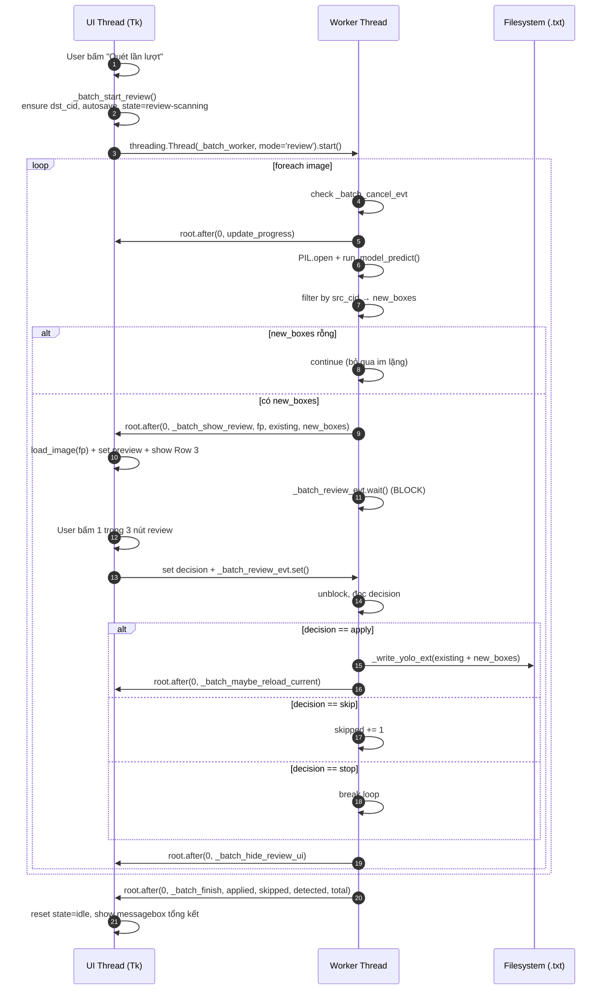
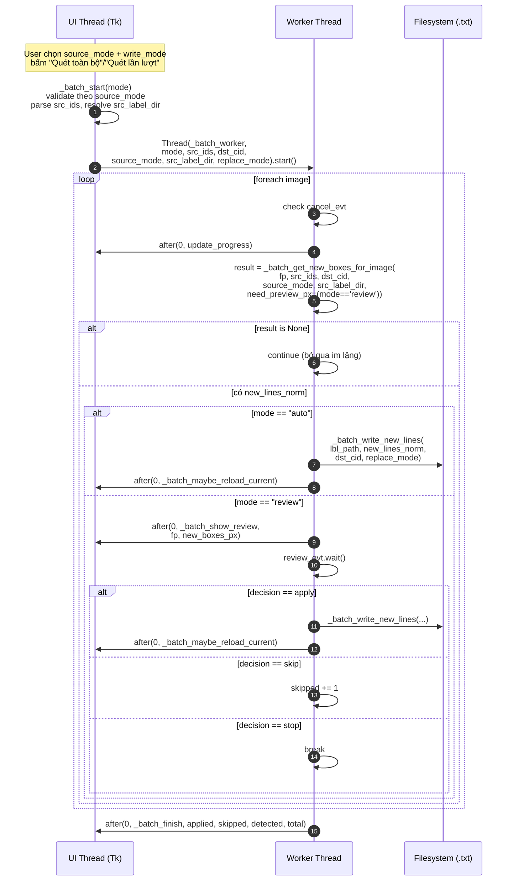

# Technical Design Doc — Bổ sung class hàng loạt (Batch Add Class)

## 1. Bối cảnh

- Link PLAN: `.claude/plans/PLAN-bbox-batch-add-class-2026-07-08.md`
- User story rút gọn (đã chốt qua AskUserQuestion): trong tab BBox Editor v1, user chọn 1 model detect đã load + 1 class nguồn (theo bảng `.names` của model), sau đó duyệt toàn bộ thư mục ảnh và APPEND các box được model detect (đã lọc đúng class nguồn) vào file YOLO `.txt` hiện có — nhãn cũ giữ nguyên, không phá tính năng detect đơn ảnh.
- 2 chế độ quét:
  - **Auto** (`🔍 Quét toàn bộ`): chạy nền hết toàn bộ ảnh, ghi thẳng vào `.txt` từng ảnh, cuối cùng báo tổng kết.
  - **Review** (`🔍 Quét lần lượt`): dừng lại ở MỖI ảnh có box mới, vẽ preview (màu khác) lên canvas chính, chờ user bấm 1 trong 3 nút review (`✅ Áp dụng & tiếp theo` / `⏭ Bỏ qua` / `⏹ Dừng`). Ảnh không có box mới → tự động bỏ qua.

## 2. Goals / Non-goals

### Goals
- Append box mới vào label YOLO `.txt` mà không xoá box cũ.
- Tái dùng tối đa model đã load ở khối Detect hiện có (`self._det_model`), pattern threading `_run_detect`/`_load_det_model`, `run_model_predict()`, `_read_yolo`/`_write_yolo`.
- Chế độ Review vẽ preview lên canvas chính bằng lớp overlay tạm, KHÔNG trộn vào `self._bboxes` cho tới khi user bấm Áp dụng.
- Nếu tên label đích chưa có trong `self.label_list` → tự append + refresh mọi combobox tham chiếu.
- Nếu ảnh hiện tại đang mở nằm trong batch và vừa được ghi → reload đúng bằng `_load_image(current_idx)`.

### Non-goals
- KHÔNG áp dụng IoU dedup ở phiên bản đầu (ghi TODO trong code).
- KHÔNG sửa `tab_bbox2.py`, không refactor sang `label_io.py`.
- KHÔNG hỗ trợ model không expose `.names` (xem quyết định (b)).

## 3. Quyết định thiết kế (a)–(i)

### (a) Model slot — DÙNG CHUNG `self._det_model` (KHÔNG tạo slot riêng)

Tái dùng hoàn toàn `self._det_model`, `self._det_model_type`, `self._det_model_names`, `self._det_conf_var`, cơ chế load bất đồng bộ `_load_det_model` / `_auto_load_det_model` / `_on_det_model_loaded` đã có.

**Lý do:**
- User luôn phải chọn model trước khi Detect đơn ảnh → model batch phải là chính model đó, tránh confusion "đang detect 1 ảnh bằng model A nhưng batch bằng model B".
- Tránh nhân đôi state (2 model trong RAM cùng lúc, đặc biệt nặng với model ONNX/RF-DETR).
- Khối UI batch chỉ cần đọc `self._det_model_names` để đổ vào dropdown class nguồn. Khi user đổi model → callback `_on_det_model_loaded` có sẵn sẽ refresh cả dropdown Detect và dropdown batch (thêm dòng gọi `self._refresh_batch_class_combo()` vào cuối hàm này).

### (b) Cách lấy `.names` để đổ vào dropdown class nguồn

| Loại model | Có `.names`? | Nguồn | Ghi chú |
|---|---|---|---|
| YOLO (Ultralytics `.pt`) | ✅ Có | `dict(mdl.names)` — đã đọc sẵn trong `_auto_load_det_model` | `{0: 'person', 1: 'bicycle', ...}` |
| RF-DETR (`.pt`) | ⚠️ Có thể | `mdl.model.names` (list hoặc dict) — đã đọc sẵn | Có thể trống nếu weight custom |
| ONNX (`_OnnxRunner`) | ❌ KHÔNG | `runner.names = {}` (hard-code rỗng, xem `yolo_onnx.py:32`) | Không có metadata class |

**Quyết định:** Tính năng batch add class **chỉ bật khi `self._det_model_names` không rỗng**. Cụ thể:

- Dropdown class nguồn được refresh trong `_refresh_batch_class_combo()`.
- Nếu `len(self._det_model_names) > 0` → đổ list `[f"{cid}: {name}" for cid, name in sorted(self._det_model_names.items())]`, enable 2 nút "Quét toàn bộ" / "Quét lần lượt".
- Nếu rỗng → dropdown = `["(model không có .names — dùng YOLO/.pt để dùng batch)"]` state readonly, disable 2 nút quét. Status label ghi rõ lý do.
- **Không cho phép user nhập tay class_id** ở bản đầu — đơn giản hoá UX, tránh sai lệch class_id giữa các model. Có thể mở sau nếu user yêu cầu.

### (c) Vị trí UI — thêm 1 `LabelFrame` mới trong khối `center`

**Vị trí trong layout:** ngay SAU `rl_tb` (Batch Relabel toolbar, dòng ~594-621), TRƯỚC `self._attr_bar` (dòng ~624). Đây là vị trí hợp lý vì cùng nhóm "thao tác batch" với Đổi nhãn.

**Cấu trúc:**

```
LabelFrame "➕ Bổ sung class hàng loạt" (bg=CARD, fg=ACCENT2, font=F_BOLD)
├── Row 1 (chọn class + label đích + 2 nút chế độ):
│   ├── Label "Class nguồn (từ model):"
│   ├── Combobox self._batch_src_class_combo (readonly, values từ model.names)
│   ├── Label "→ Nhãn đích:"
│   ├── Entry self._batch_dst_label_var (StringVar, cho user gõ tên nhãn đích)
│   ├── Button "🔍 Quét toàn bộ" → self._batch_start_auto
│   ├── Button "🔍 Quét lần lượt" → self._batch_start_review
│   └── Button "⏹ Dừng" (ẩn ban đầu, hiện khi batch đang chạy) → self._batch_stop
├── Row 2 (progress + status):
│   ├── ttk.Progressbar self._batch_pb (K.Horizontal.TProgressbar, maximum=100)
│   └── Label self._batch_status_lbl (text="", fg=DIM)
└── Row 3 (nút review — CHỈ hiện ở chế độ Review khi đang chờ user quyết định):
    ├── Button "✅ Áp dụng & tiếp theo" (bg="#2e7d32") → self._batch_review_apply
    ├── Button "⏭ Bỏ qua" (bg=ACCENT2) → self._batch_review_skip
    └── (Nút "⏹ Dừng" ở Row 1 dùng chung cho cả 2 chế độ)
```

Row 3 dùng `frame.pack_forget()` / `frame.pack()` để ẩn/hiện. Ban đầu ẩn — chỉ hiện khi thread nền báo lên "đang chờ user quyết định ảnh này".

State machine (biến `self._batch_state`):
- `"idle"` — không quét, 2 nút bấm "Quét toàn bộ"/"Quét lần lượt" enable, "⏹ Dừng" ẩn, Row 3 ẩn.
- `"auto"` — đang chạy Auto, 2 nút quét disable, "⏹ Dừng" hiện, Row 3 ẩn.
- `"review-scanning"` — đang detect ảnh kế tiếp trong chế độ Review, 2 nút quét disable, "⏹ Dừng" hiện, Row 3 ẩn.
- `"review-waiting"` — thread nền đang chờ user quyết định, Row 3 hiện với 2 nút Áp dụng/Bỏ qua, "⏹ Dừng" vẫn hiện.

### (d) Luồng threading

Cả 2 chế độ dùng 1 thread nền duy nhất chạy vòng `for real_idx, fp in enumerate(self.image_files)`, gọi `run_model_predict(...)` trên từng ảnh (mở PIL trực tiếp trong thread nền — model đã thread-safe cho inference đơn ảnh, `_run_detect` hiện có cũng chạy pattern y hệt).

**Đồng bộ với UI thread:**
- `self._batch_cancel_evt = threading.Event()` — main thread `set()` khi user bấm "⏹ Dừng"; thread nền check trước mỗi ảnh, `break` khi set.
- `self._batch_review_evt = threading.Event()` — thread nền `wait()` sau khi detect ra 1 ảnh có box mới ở chế độ Review; main thread `set()` khi user bấm Áp dụng/Bỏ qua/Dừng.
- `self._batch_review_decision` = `"apply"` | `"skip"` | `"stop"` — main thread ghi trước khi `set()` Event; thread nền đọc sau khi `wait()`.
- Mọi update UI (progress bar, status label, hiện/ẩn Row 3, vẽ preview canvas) phải gọi qua `self.root.after(0, ...)` — theo đúng pattern `_run_detect`/`_load_det_model` hiện có. TUYỆT ĐỐI KHÔNG động vào canvas/widget trực tiếp từ thread nền.

**Pseudocode thread nền (dùng chung cả 2 chế độ):**

```python
def _batch_worker(self, mode: str, src_cid: int, dst_label: str):
    """Chạy trong daemon thread. mode ∈ {'auto', 'review'}."""
    total = len(self.image_files)
    applied = skipped = detected = 0

    # (1) Đảm bảo class_id đích tồn tại — làm trên UI thread trước khi worker chạy
    #     (xem (f)). Worker chỉ đọc self._batch_dst_cid (đã set sẵn).
    dst_cid = self._batch_dst_cid

    for i, fp in enumerate(self.image_files):
        if self._batch_cancel_evt.is_set():
            break
        self.root.after(0, self._batch_update_progress, i, total, fp.name)

        # (2) Detect ảnh này
        try:
            from PIL import Image
            pil = Image.open(fp).convert("RGB")
            iw, ih = pil.size
            boxes = run_model_predict(
                self._det_model, self._det_model_type, pil, self._det_conf_var.get())
        except Exception as e:
            # log lỗi ảnh này, tiếp tục ảnh sau
            continue

        # (3) Lọc đúng class nguồn
        new_boxes = [(dst_cid, x1, y1, x2, y2)      # class_id đã ĐỔI sang dst_cid
                     for cid, x1, y1, x2, y2, _sc in boxes if cid == src_cid]
        if not new_boxes:
            continue  # cả 2 chế độ: ảnh không có box mới → bỏ qua im lặng
        detected += 1

        # (4) Đọc box cũ từ file .txt (nếu có)
        lbl_path = self._resolve_lbl_path(fp)
        existing = self._read_yolo_ext(lbl_path, iw, ih)  # xem (h)

        if mode == "auto":
            # (5a) Ghi thẳng append + reload nếu ảnh đang mở
            merged = existing + [list(b) for b in new_boxes]
            self._write_yolo_ext(lbl_path, merged, iw, ih)
            applied += 1
            self.root.after(0, self._batch_maybe_reload_current, fp)
        else:  # mode == "review"
            # (5b) Gửi preview lên UI thread, mở ảnh đó, chờ quyết định
            self.root.after(0, self._batch_show_review, fp, existing, new_boxes)
            self._batch_review_evt.clear()
            self._batch_review_evt.wait()   # BLOCK cho tới khi user bấm nút review
            if self._batch_cancel_evt.is_set() or self._batch_review_decision == "stop":
                break
            if self._batch_review_decision == "apply":
                merged = existing + [list(b) for b in new_boxes]
                self._write_yolo_ext(lbl_path, merged, iw, ih)
                applied += 1
                self.root.after(0, self._batch_maybe_reload_current, fp)
            else:  # "skip"
                skipped += 1
            self.root.after(0, self._batch_hide_review_ui)

    # (6) Kết thúc
    self.root.after(0, self._batch_finish, applied, skipped, detected, total)
```

**Chống deadlock:**
- `_batch_review_evt.wait()` không có timeout — nhưng luôn được `set()` ở đúng 1 trong 3 nút Review + nút Dừng (cả 4 nút đều gọi `self._batch_review_evt.set()`).
- Nút "⏹ Dừng" (Row 1) khi ấn: `_batch_cancel_evt.set()` + `_batch_review_decision = "stop"` + `_batch_review_evt.set()` → thread nền đang `wait()` sẽ unblock ngay, check cancel_evt và break.
- Nếu user đóng cửa sổ giữa chừng → `WM_DELETE_WINDOW` không được override thêm ở task này (BBoxEditorTab không phải Toplevel). Nhưng đảm bảo `_batch_worker` là daemon thread → app đóng thì thread tự chết.
- Trên UI thread, mọi callback từ `root.after(0, ...)` là short-lived (chỉ update label + hiện/ẩn frame) — không có nested `wait()` → không có deadlock giao nhau.

### (e) Vẽ preview không trộn vào `self._bboxes`

Thêm 2 biến state (init trong `__init__`):

```python
self._batch_preview_boxes  = []     # list [(dst_cid, x1, y1, x2, y2), ...] trong tọa độ ẢNH GỐC
self._batch_preview_active = False
```

Trong `_render()` (dòng ~1211-1250) — thêm 1 dòng gọi `self._draw_batch_preview_overlay()` sau `self._draw_zoomtest_overlay()`.

Trong `_redraw_bboxes_only()` (dòng ~1306-1313) — thêm `self._canvas.delete("batch_preview_item")` + `self._draw_batch_preview_overlay()`.

Hàm mới (giống `_draw_zoomtest_overlay` — pattern đã có sẵn, dòng ~3671-3692):

```python
def _draw_batch_preview_overlay(self):
    """Vẽ overlay preview (màu cam đứt nét) cho box mới do batch detect được.
    KHÔNG trộn vào self._bboxes — chỉ hiển thị đến khi user bấm Áp dụng/Bỏ qua."""
    if not self._batch_preview_active or self._pil_img is None:
        return
    lw = max(2, self._line_width_var.get() + 1)  # dày hơn 1px so với box thường
    color = "#F05922"                             # ACCENT cam — nổi bật
    for cid, x1, y1, x2, y2 in self._batch_preview_boxes:
        cx1 = int(x1 * self._scale) + self._off_x
        cy1 = int(y1 * self._scale) + self._off_y
        cx2 = int(x2 * self._scale) + self._off_x
        cy2 = int(y2 * self._scale) + self._off_y
        name = self.label_list[cid] if cid < len(self.label_list) else str(cid)
        txt  = f" ➕ {name} "
        tw   = max(len(txt) * 7, 30)
        self._canvas.create_rectangle(cx1, cy1, cx2, cy2,
            outline=color, width=lw, dash=(8, 4), tags="batch_preview_item")
        self._canvas.create_rectangle(cx1, cy1 - 17, cx1 + tw, cy1,
            fill=color, outline="", tags="batch_preview_item")
        self._canvas.create_text(cx1 + 3, cy1 - 8, text=txt, fill="white",
            font=("Segoe UI", 8, "bold"), anchor=W, tags="batch_preview_item")
```

`_batch_show_review(fp, existing, new_boxes)` (chạy UI thread) làm:
1. `self._autosave()` (lưu ảnh đang mở trước nếu dirty).
2. Gọi `self._load_image(real_idx_of_fp)` — reload đúng ảnh trong batch với `_bboxes = existing` (đọc lại từ .txt qua flow chuẩn).
3. `self._batch_preview_boxes = list(new_boxes)`; `self._batch_preview_active = True`.
4. `self._render()` — canvas hiện GT (existing màu thường) + preview (cam đứt nét).
5. `self._batch_review_frame.pack(...)` hiện Row 3.
6. `self._batch_state = "review-waiting"`.

`_batch_hide_review_ui()`:
1. `self._batch_preview_boxes = []`; `self._batch_preview_active = False`.
2. `self._canvas.delete("batch_preview_item")`.
3. `self._batch_review_frame.pack_forget()`.

### (f) Cập nhật `label_list` + refresh combobox

Ngay khi user bấm "Quét toàn bộ" / "Quét lần lượt" (UI thread, TRƯỚC khi start thread nền):

1. Đọc `dst_label = self._batch_dst_label_var.get().strip()`. Nếu rỗng → thông báo lỗi, không start.
2. Nếu `dst_label` đã có trong `self.label_list` → `dst_cid = self.label_list.index(dst_label)`.
3. Nếu chưa có → append vào `self.label_list`, `dst_cid = len(self.label_list) - 1`, GỌI helper `self._refresh_label_widgets()` (hàm mới, xem dưới) để đồng bộ:
   - `self._labels_var` = ",".join(self.label_list) (giữ config `bbox.labels` khớp).
   - `self._cls_lb` (Listbox class chính, dòng 402-407, 934-939) — clear + insert lại toàn bộ với màu palette.
   - `self._cls_combo["values"]` (Combobox class chính, dòng 485-486, 941).
   - `self._filter_label_combo["values"]` (Combobox filter theo nhãn, dòng 242, 954).
   - `self._rl_from_combo["values"]` + `self._rl_to_combo["values"]` (Batch Relabel, dòng 600-607, 945-950).
   - `self._must_have_lb` + `self._must_not_lb` (dòng 331-355, 967-974).
   - `self._batch_src_class_combo` KHÔNG đụng (dropdown class NGUỒN từ model, không phải label list).
4. Set `self._batch_dst_cid = dst_cid` (worker đọc biến này).

Việc refresh label widgets tách thành 1 hàm private mới để tái dùng — tránh copy-paste 7 chỗ update.

### (g) Reload ảnh đang mở

Sau MỖI lần ghi file `.txt` trong worker (cả 2 chế độ), gọi `self.root.after(0, self._batch_maybe_reload_current, fp)`:

```python
def _batch_maybe_reload_current(self, fp: Path):
    """Nếu ảnh vừa ghi là ảnh đang mở → reload để self._bboxes khớp file mới."""
    if self.current_idx < 0:
        return
    if self.image_files[self.current_idx] == fp:
        # KHÔNG gọi self._autosave() ở đây — nếu ảnh đang mở dirty thì save lúc này
        # sẽ ghi ĐÈ box vừa append của batch. Ta chọn ưu tiên batch (đã ghi xong)
        # → discard modification chưa lưu trong ảnh đang mở, reload lại từ đĩa.
        self._modified = False
        self._load_image(self.current_idx)
```

**Lưu ý quan trọng — race condition với `_autosave`:**
- Khi user bấm "Quét toàn bộ", ảnh đang mở CÓ THỂ đang dirty (`_modified = True`). Trong UI handler trước khi start worker, PHẢI gọi `self._autosave()` để lưu changes chưa commit — tránh mất dữ liệu.
- Ở chế độ Review, `_batch_show_review` cũng gọi `_autosave()` trước khi `_load_image(fp)` để không mất changes ảnh trước.

### (h) Hàm/method mới cần thêm (chốt tên, Senior Dev PHẢI theo)

| Method | Signature | Nơi gọi | Mô tả ngắn |
|---|---|---|---|
| `_build_batch_add_class_ui(self, parent)` | `→ None` | trong `_build`, sau `rl_tb` | Tạo LabelFrame + widgets, gán biến state. |
| `_refresh_batch_class_combo(self)` | `→ None` | Cuối `_on_det_model_loaded` + sau `_build_batch_add_class_ui` | Đổ lại `self._batch_src_class_combo["values"]` từ `self._det_model_names`, enable/disable 2 nút quét. |
| `_refresh_label_widgets(self)` | `→ None` | Sau khi append `self.label_list` (f), có thể tái dùng ở nơi khác nếu thấy phù hợp | Đồng bộ mọi combobox/listbox tham chiếu `label_list`. |
| `_batch_start_auto(self)` | `→ None` | Button `🔍 Quét toàn bộ` | Validate input, ensure dst_cid, spawn worker mode="auto". |
| `_batch_start_review(self)` | `→ None` | Button `🔍 Quét lần lượt` | Validate input, ensure dst_cid, spawn worker mode="review". |
| `_batch_worker(self, mode, src_cid, dst_label)` | `→ None` (daemon thread) | Được thread khởi tạo trong `_batch_start_*` | Vòng lặp chính (pseudocode ở (d)). |
| `_batch_show_review(self, fp, existing, new_boxes)` | `→ None` (UI thread via after) | Từ worker khi mode="review" | Load ảnh + set preview + hiện Row 3. |
| `_batch_review_apply(self)` | `→ None` | Button `✅ Áp dụng & tiếp theo` | Set decision="apply" + set review_evt. |
| `_batch_review_skip(self)` | `→ None` | Button `⏭ Bỏ qua` | Set decision="skip" + set review_evt. |
| `_batch_stop(self)` | `→ None` | Button `⏹ Dừng` | Set cancel_evt + decision="stop" + review_evt. |
| `_batch_hide_review_ui(self)` | `→ None` (UI thread) | Sau khi worker nhận decision | Clear preview, ẩn Row 3. |
| `_batch_update_progress(self, i, total, name)` | `→ None` (UI thread) | Từ worker mỗi ảnh | Update progressbar + status label. |
| `_batch_maybe_reload_current(self, fp)` | `→ None` (UI thread) | Sau mỗi lần worker ghi .txt | Reload nếu ảnh vừa ghi là ảnh đang mở. |
| `_batch_finish(self, applied, skipped, detected, total)` | `→ None` (UI thread) | Cuối worker | Reset state → "idle", show messagebox tổng kết. |
| `_resolve_lbl_path(self, fp)` | `→ Path` | Dùng trong worker | Tính đường dẫn `.txt` từ image path + `self.lbl_dir_var` (giống logic sẵn có trong `_load_image` dòng 1055-1057). |
| `_read_yolo_ext(self, path, iw, ih)` | `→ list` | Trong worker | Bản NON-instance-image của `_read_yolo` — nhận `(iw, ih)` explicit thay vì `self._pil_img.size`. |
| `_write_yolo_ext(self, path, bboxes, iw, ih)` | `→ None` | Trong worker | Bản NON-instance-image của `_write_yolo` — nhận `(bboxes, iw, ih)` explicit. GIỮ NGUYÊN xử lý 5-token vs 9-token (poly4) như `_write_yolo`. |
| `_draw_batch_preview_overlay(self)` | `→ None` (UI thread) | Trong `_render` + `_redraw_bboxes_only` | Vẽ overlay preview cam đứt nét (xem (e)). |

**Biến state mới trong `__init__`:**

```python
# ── Batch Add Class ──────────────────────────────────────────────
self._batch_state          = "idle"          # idle | auto | review-scanning | review-waiting
self._batch_cancel_evt     = None            # threading.Event, tạo mới mỗi lần start
self._batch_review_evt     = None            # threading.Event
self._batch_review_decision = None           # "apply" | "skip" | "stop"
self._batch_dst_cid        = -1
self._batch_preview_boxes  = []              # [(cid, x1, y1, x2, y2), ...] tọa độ ảnh gốc
self._batch_preview_active = False
self._batch_src_class_var  = StringVar()     # combobox class nguồn
self._batch_dst_label_var  = StringVar()     # entry tên label đích
```

### (i) Rủi ro & cách giảm thiểu

| Rủi ro | Giảm thiểu |
|---|---|
| `_write_yolo_ext` phá dòng OBB 9-token khi merge box mới 5-token vào file có sẵn box 9-token | `_read_yolo_ext` đọc CẢ 5-token và 9-token (giữ nguyên logic `_read_yolo` dòng 1080-1103), trả về list ann có len=5 hoặc len=9 tuỳ box. `_write_yolo_ext` ghi lại đúng format theo `len(ann)` (giữ nguyên logic `_write_yolo` dòng 1105-1124). Box mới do batch thêm luôn là len=5. → Merged list có mix 5/9, cả 2 hàm hiện tại đã handle đúng, chỉ cần thay `self._pil_img.size`/`self._bboxes` bằng tham số explicit. |
| Race condition: user thao tác canvas (kéo, vẽ box mới) trên ảnh đang mở trong lúc worker ghi vào .txt của chính ảnh đó | `_batch_maybe_reload_current` sẽ discard `_modified=True` và reload từ đĩa. Ghi rõ trong docstring. UX: khi start batch, hiển thị status label warn "Không thao tác canvas trong khi batch chạy". |
| Deadlock nếu user đóng tab/app giữa Review đang `wait()` | `_batch_worker` chạy daemon → app kill thì thread tự die. Không có shared resource cần cleanup thủ công. |
| Model ONNX không có `.names` → user vẫn bấm được nút quét | Xử lý đã có ở (b): disable nút khi `_det_model_names` rỗng + status label ghi rõ. |
| Nút "⏹ Dừng" bấm giữa Auto — worker đang chạy `run_model_predict` (blocking, có thể vài giây) | Chấp nhận trễ 1 ảnh: `cancel_evt` chỉ được check ĐẦU vòng lặp mỗi ảnh, không interrupt inference. Status label ghi "Đang dừng sau ảnh này…" khi user bấm Dừng. |
| Ảnh mở lỗi (`PIL.Image.open` fail) trong worker | `try/except` bọc, log qua status label, `continue` sang ảnh sau. Không tăng `applied`/`skipped`. |
| User bấm liên tiếp "Quét toàn bộ" 2 lần | `_batch_start_*` check `self._batch_state != "idle"` → bail out, hiện thông báo "Đang có batch chạy". |
| Recursive folder — `self.image_files` có thể chứa ảnh trong subfolder | Không vấn đề — worker dùng path đầy đủ từ `self.image_files`, `_resolve_lbl_path` giữ đúng cấu trúc. |
| Class nguồn khớp id nhưng tên model.names khác label_list — VD model.names[0]="person", label_list[0]="car" | Chấp nhận có chủ ý: user CHỦ ĐỘNG chọn class nguồn từ dropdown model, và tự nhập label đích. Không mapping tự động → tránh nhầm lẫn. |

## 4. Kiến trúc (mermaid)



## 5. Task breakdown cho Senior Developer (Phase 2)

| ID | Tên | Ước tính | Phụ thuộc |
|---|---|---|---|
| 2.1a | Thêm state variables trong `__init__` (block "Batch Add Class") | 10 phút | - |
| 2.1b | Viết `_build_batch_add_class_ui(parent)` + gọi trong `_build` sau `rl_tb` | 40 phút | 2.1a |
| 2.1c | Viết `_refresh_batch_class_combo()` + gọi trong `_on_det_model_loaded` + cuối `_build_batch_add_class_ui` | 15 phút | 2.1b |
| 2.1d | Viết `_refresh_label_widgets()` — refactor code duplicate từ `_load_dataset` | 30 phút | - |
| 2.1e | Viết `_resolve_lbl_path`, `_read_yolo_ext`, `_write_yolo_ext` (bản explicit iw/ih) | 20 phút | - |
| 2.1f | Viết `_batch_start_auto`, `_batch_start_review`, `_batch_stop` (UI handlers) | 30 phút | 2.1a, 2.1d, 2.1e |
| 2.1g | Viết `_batch_worker` (thread nền, pseudocode ở (d)) | 45 phút | 2.1e, 2.1f |
| 2.1h | Viết callback UI thread: `_batch_show_review`, `_batch_hide_review_ui`, `_batch_review_apply`, `_batch_review_skip`, `_batch_update_progress`, `_batch_maybe_reload_current`, `_batch_finish` | 45 phút | 2.1g |
| 2.1i | Viết `_draw_batch_preview_overlay` + thêm vào `_render` + `_redraw_bboxes_only` | 15 phút | 2.1a |
| 2.1j | Test smoke tay: load model yolo11n.pt, chạy Auto + Review + Dừng giữa chừng | 30 phút | 2.1a-i |
| **Tổng** | | **~4h30** | |

## 6. Checklist tài liệu đồng bộ (nhúng vào PR)

- [x] PRD — Không có (feature nhỏ, đã chốt qua AskUserQuestion)
- [x] User Story — Không có (như trên, PLAN đã chứa scope)
- [x] TDD — File này
- [ ] DESIGN — Không cần (UI thêm vào LabelFrame đơn giản, đã mô tả layout ở (c))
- [ ] ADR — Không cần (không thay đổi kiến trúc lớn)
- [ ] Test case — QA sẽ viết ở bước 3.2 sau khi code xong

## 7. Lịch sử cập nhật

| Ngày | Cập nhật | Người |
|---|---|---|
| 2026-07-08 | Bản đầu, chốt quyết định (a)-(i) | Tech Lead |
| 2026-07-08 20:55 | Bổ sung mục 8. Amendment (Phase 4): model picker trong khung, 2 nguồn nhãn (model/thư mục), chế độ ghi (append/replace), refactor `_batch_get_new_boxes_for_image` + `_batch_write_new_lines` (text-level write). | Tech Lead |

---

## 8. Amendment (Phase 4) — Model picker + Import từ thư mục label + Chế độ Thay thế/Chỉ thêm

> Bản gốc (mục 1-7) đã QA PASS ở Phase 3 (commit e6b1f73/fe7a1ec). Amendment này BỔ SUNG — không thay đổi hành vi mặc định (Model detect + Append). Mọi thay đổi được thiết kế để 100% tương thích ngược: user không đổi gì thì flow chạy y hệt bản gốc.

### 8.1 Bối cảnh & yêu cầu chốt

3 yêu cầu chốt qua AskUserQuestion (xem Phase 4 trong plan):

1. **Model picker tiện dụng** — thêm 1 dòng trong khung Batch: filename model + nút "📂 Đổi model" gọi `_browse_det_model` hiện có. KHÔNG tạo biến model mới — vẫn dùng chung `self._det_model`.
2. **Nguồn nhãn — thêm 1 chế độ MỚI song song với "Model detect":**
   - `🤖 Model detect` (mặc định, y hệt bản gốc).
   - `📁 Thư mục label có sẵn` (MỚI) — user chọn 1 thư mục label khác + nhập 1 hoặc nhiều `class_id` nguồn (VD `"0"` hoặc `"0,2,5"`). Với mỗi ảnh trong `img_dir_var`, tìm file `.txt` cùng stem trong thư mục nguồn, đọc dòng có `class_id ∈ src_ids`, đổi `class_id` sang `dst_cid`, ghi vào file đích. **KHÔNG cần mở ảnh trong chế độ Auto** (cả nguồn và đích đều normalized 0-1). Ảnh không có file nguồn → bỏ qua im lặng.
3. **Chế độ ghi — thêm radio mới:**
   - `Chỉ thêm (append)` — mặc định, y hệt bản gốc.
   - `Thay thế nhãn cùng class đích` — TRƯỚC khi append, xoá khỏi file đích TẤT CẢ dòng có `class_id == dst_cid` (chỉ xoá đúng class đích, giữ nguyên nhãn khác cả 5-token lẫn 9-token OBB).

### 8.2 Quyết định thiết kế Amendment

#### (a) Vị trí model picker trong `_build_batch_add_class_ui`

Thêm **1 row mới ở ĐẦU** LabelFrame (trước Row 1 hiện tại), dùng `pack` với `fill=X`:

```
Row A (Model picker — MỚI):
  Label "🤖 Model:"
  Label self._batch_model_lbl (text=basename model_path hoặc "(chưa load)")
  Button "📂 Đổi model" → self._browse_det_model
```

- `self._batch_model_lbl` là 1 widget MỚI trong khung Batch. Cập nhật đồng thời với `self._det_model_lbl` (khung Detect phía trên) trong `_on_det_model_loaded` — thêm 1 lệnh `self._batch_refresh_model_display(path)` vào cuối hàm này (đã có sẵn `_refresh_batch_class_combo()`, chỉ thêm 1 dòng nữa).
- Widget dùng chung `self._det_model` — KHÔNG tạo biến model batch riêng.
- Nút "📂 Đổi model" gọi trực tiếp `self._browse_det_model` (đã có, không sửa).
- Khi widget vừa build xong (cuối `_build_batch_add_class_ui`), gọi `self._batch_refresh_model_display()` để hiển thị model đã load từ session (nếu có).

#### (b) UI cho 2 nguồn nhãn — Radiobutton + Frame group ẩn/hiện

Dùng pattern `pack_forget()`/`pack()` đã áp dụng cho Row 3 review buttons (line 3807, 4171, 4179). Không dùng toggle button — Radiobutton chuẩn Tkinter dễ đọc và tự exclusive.

**Layout mới (sau Row A model picker):**

```
Row B (Source selector — MỚI):
  Label "Nguồn nhãn:"
  Radiobutton "🤖 Model detect"  variable=self._batch_src_mode_var value="model"
                                 command=self._on_batch_src_mode_change
  Radiobutton "📁 Thư mục label" variable=self._batch_src_mode_var value="folder"
                                 command=self._on_batch_src_mode_change

Row C1 (Model source group — hiện khi mode="model"):  Frame self._batch_src_model_frame
  Label "Class nguồn:"
  Combobox self._batch_src_class_combo (readonly, values từ model.names)  ← có sẵn

Row C2 (Folder source group — hiện khi mode="folder"): Frame self._batch_src_folder_frame
  Label "Thư mục label nguồn:"
  Entry  textvariable=self._batch_src_label_dir_var
  Button "📁"  command=self._batch_browse_src_label_dir
  Label "Class id nguồn:"
  Entry  textvariable=self._batch_src_class_ids_var  width=14  (VD: "0" hoặc "0,2,5")

Row D (Nhãn đích + Chế độ ghi):
  Label "→ Nhãn đích:"    Entry textvariable=self._batch_dst_label_var  ← có sẵn, giữ nguyên
  Label "   Chế độ:"
  Radiobutton "Chỉ thêm"    variable=self._batch_write_mode_var value="append"
  Radiobutton "Thay thế"    variable=self._batch_write_mode_var value="replace"

Row E (Buttons):
  Button "🔍 Quét toàn bộ"  self._btn_batch_auto     ← có sẵn, giữ nguyên
  Button "🔍 Quét lần lượt" self._btn_batch_review   ← có sẵn, giữ nguyên
  Button "⏹ Dừng"          self._btn_batch_stop     ← có sẵn, giữ nguyên (ẩn ban đầu)

Row F (Progress + status):        ← Row 2 hiện tại, giữ nguyên
Row G (Review Áp dụng/Bỏ qua):    ← Row 3 hiện tại, giữ nguyên
```

**Callback `_on_batch_src_mode_change`:**

```python
def _on_batch_src_mode_change(self, _event=None):
    mode = self._batch_src_mode_var.get()
    if mode == "model":
        self._batch_src_folder_frame.pack_forget()
        self._batch_src_model_frame.pack(fill=X, pady=(0, 2))
    else:  # "folder"
        self._batch_src_model_frame.pack_forget()
        self._batch_src_folder_frame.pack(fill=X, pady=(0, 2))
```

Mặc định `self._batch_src_mode_var = StringVar(value="model")` → Row C1 packed sẵn khi build.

#### (c) Refactor luồng lấy box mới thành 1 hàm trừu tượng

Cả 2 chế độ dùng chung phần threading + progress + review UI của bản gốc. CHỈ khác ở bước "lấy danh sách box mới cho 1 ảnh". Rút gọn thành 1 hàm:

**Signature:**

```python
def _batch_get_new_boxes_for_image(
    self,
    fp: Path,
    src_ids: set,             # 1 phần tử (model) hoặc nhiều phần tử (folder)
    dst_cid: int,
    source_mode: str,         # "model" | "folder"
    src_label_dir: Path | None,   # None khi source_mode="model"
    need_preview_px: bool,    # True ở chế độ review, False ở chế độ auto
) -> tuple[list, list, int, int] | None:
    """
    Trả về (new_lines_norm, new_boxes_px, iw, ih) hoặc None nếu không có box mới.

    - new_lines_norm : list[str]
        Các dòng YOLO 5-token đã format sẵn, class_id = dst_cid, tọa độ normalized 0-1.
        VD: ["1 0.523456 0.612345 0.104321 0.208765", ...]
        Sẽ được append/replace vào file đích ở bước ghi (text-level).
    - new_boxes_px   : list[(dst_cid, x1, y1, x2, y2)]
        Toạ độ pixel cho preview overlay ở chế độ Review.
        Trả về [] nếu source_mode="folder" và need_preview_px=False (không mở ảnh).
    - iw, ih         : int
        Kích thước ảnh (pixel). Trả về 0/0 nếu source_mode="folder" và need_preview_px=False.
    """
```

**Pseudocode:**

```python
def _batch_get_new_boxes_for_image(self, fp, src_ids, dst_cid,
                                    source_mode, src_label_dir, need_preview_px):
    if source_mode == "model":
        # Path CŨ — giống bản gốc, mở PIL + inference.
        try:
            pil = self._PIL_Image.open(fp).convert("RGB")
            iw, ih = pil.size
            boxes = run_model_predict(
                self._det_model, self._det_model_type, pil,
                self._det_conf_var.get())
        except Exception:
            return None
        # Lọc theo src_ids (set — chỉ có 1 phần tử với model source)
        matched = [(x1, y1, x2, y2) for cid, x1, y1, x2, y2, _sc in boxes if cid in src_ids]
        if not matched:
            return None
        new_lines_norm = []
        new_boxes_px   = []
        for x1, y1, x2, y2 in matched:
            xc = max(0.0, min(1.0, ((x1 + x2) / 2) / iw))
            yc = max(0.0, min(1.0, ((y1 + y2) / 2) / ih))
            bw = max(1e-4, min(1.0, (x2 - x1) / iw))
            bh = max(1e-4, min(1.0, (y2 - y1) / ih))
            new_lines_norm.append(f"{int(dst_cid)} {xc:.6f} {yc:.6f} {bw:.6f} {bh:.6f}")
            new_boxes_px.append((dst_cid, x1, y1, x2, y2))
        return (new_lines_norm, new_boxes_px, iw, ih)

    else:  # source_mode == "folder"
        src_lbl_path = src_label_dir / (fp.stem + ".txt")
        if not src_lbl_path.exists():
            return None  # ảnh không có file nguồn — bỏ qua im lặng
        # Đọc raw lines, lọc theo src_ids, đổi class_id → dst_cid.
        new_lines_norm = []
        try:
            with open(src_lbl_path, encoding="utf-8") as f:
                for line in f:
                    parts = line.strip().split()
                    if len(parts) < 5:      # bỏ qua dòng lạ / trống / thiếu token
                        continue
                    try:
                        cid_src = int(parts[0])
                    except ValueError:
                        continue
                    if cid_src not in src_ids:
                        continue
                    # CHỈ nhận 5-token bbox. 9-token OBB nguồn — bỏ qua ở bản này
                    # (out of scope: batch không hỗ trợ import OBB từ folder — nếu cần, mở ticket).
                    if len(parts) != 5:
                        continue
                    # Đổi cid → dst_cid, giữ nguyên 4 số normalized còn lại
                    new_lines_norm.append(
                        f"{int(dst_cid)} {parts[1]} {parts[2]} {parts[3]} {parts[4]}")
        except Exception:
            return None
        if not new_lines_norm:
            return None
        # Với preview mode (review), cần convert normalized → pixel
        if need_preview_px:
            try:
                with self._PIL_Image.open(fp) as _im:
                    iw, ih = _im.size
            except Exception:
                iw, ih = 0, 0
            new_boxes_px = []
            for ln in new_lines_norm:
                p = ln.strip().split()
                if len(p) != 5: continue
                _, xc, yc, w, h = p
                xc, yc, w, h = map(float, (xc, yc, w, h))
                x1 = (xc - w/2) * iw; y1 = (yc - h/2) * ih
                x2 = (xc + w/2) * iw; y2 = (yc + h/2) * ih
                new_boxes_px.append((dst_cid, x1, y1, x2, y2))
            return (new_lines_norm, new_boxes_px, iw, ih)
        else:
            # Auto mode + folder: KHÔNG mở ảnh, không tính pixel preview.
            return (new_lines_norm, [], 0, 0)
```

#### (d) Vị trí đặt logic "Thay thế" — Hàm `_batch_write_new_lines` (text-level)

**Quyết định:** Không sửa `_write_yolo_ext` hiện có (giữ nguyên, dùng cho backward compat — sẽ không được `_batch_worker` gọi nữa sau amendment, nhưng để lại phòng khi cần rollback). Thay thế bước ghi trong worker bằng hàm MỚI **text-level**:

```python
def _batch_write_new_lines(
    self,
    lbl_path: Path,
    new_lines_norm: list,
    dst_cid: int,
    replace_mode: bool,
) -> None:
    """Ghi file .txt đích theo chế độ append/replace, thao tác text-level.

    - Đọc raw text lines hiện có (giữ nguyên format 5-token/9-token OBB).
    - Nếu replace_mode=True: xoá TẤT CẢ dòng có class_id == dst_cid (số nguyên khớp),
      giữ mọi dòng khác (kể cả 9-token OBB có cid ≠ dst_cid).
    - Append new_lines_norm vào cuối.
    - Ghi lại file (mkdir parents nếu cần).

    KHÔNG cần iw/ih. KHÔNG convert normalized ↔ pixel — an toàn tuyệt đối với OBB 9-token.
    """
    existing_lines = []
    if lbl_path.exists():
        try:
            with open(lbl_path, encoding="utf-8") as f:
                existing_lines = [ln.rstrip("\n") for ln in f if ln.strip()]
        except Exception:
            existing_lines = []

    if replace_mode:
        keep = []
        for ln in existing_lines:
            parts = ln.strip().split()
            if not parts:
                continue
            try:
                cid = int(parts[0])
            except ValueError:
                keep.append(ln)     # giữ nguyên dòng lạ (không có cid số)
                continue
            if cid == dst_cid:
                continue            # XOÁ dòng có class_id == dst_cid
            keep.append(ln)
        existing_lines = keep

    all_lines = existing_lines + list(new_lines_norm)
    lbl_path.parent.mkdir(parents=True, exist_ok=True)
    with open(lbl_path, "w", encoding="utf-8") as f:
        f.write("\n".join(all_lines))
```

**Lý do đặt logic Thay thế ở đây (thay vì trong `_write_yolo_ext`):**

1. Text-level cực an toàn — không đụng đến 9-token OBB (dòng có `cid ≠ dst_cid` được giữ nguyên byte-by-byte, không parse-rồi-write-lại → không có rủi ro làm tròn float sai hoặc mất precision).
2. Tách biệt trách nhiệm — `_write_yolo_ext` (đọc/ghi pixel ↔ normalized) vẫn giữ nguyên, không cần thêm tham số làm rối signature.
3. Đơn điểm quyết định — mọi luồng ghi (model/folder × append/replace) đều đi qua hàm này → dễ test, dễ log, dễ debug.
4. Loại bỏ hoàn toàn conversion pixel↔normalized trong worker cho folder source — đúng theo yêu cầu user "KHÔNG cần mở ảnh".

**Update `_batch_worker` step (5a) và (5b) trong pseudocode gốc:**

Thay:
```python
# Cũ:
existing = self._read_yolo_ext(lbl_path, iw, ih)
merged = existing + [list(b) for b in new_boxes]
self._write_yolo_ext(lbl_path, merged, iw, ih)
```

Bằng:
```python
# Mới:
self._batch_write_new_lines(lbl_path, new_lines_norm, dst_cid, replace_mode)
```

Không cần `existing` ở worker nữa — logic append/replace đã trọn gói trong helper.

#### (e) Parse nhiều class_id nguồn (folder source)

```python
def _batch_parse_src_ids(self) -> tuple[set, str]:
    """Parse ô class_id nguồn (chỉ dùng khi source_mode='folder').
    Chấp nhận '0' / '0,2,5' / '0, 2 , 5' / '0;2;5' (tolerance).
    Trả về (ids: set[int], err_msg: str). Nếu err_msg khác rỗng → invalid.
    """
    raw = self._batch_src_class_ids_var.get().strip()
    if not raw:
        return set(), "Vui lòng nhập ít nhất 1 class id nguồn (VD: 0 hoặc 0,2,5)."
    ids = set()
    for tok in raw.replace(";", ",").split(","):
        t = tok.strip()
        if not t: continue
        try:
            ids.add(int(t))
        except ValueError:
            return set(), f"Class id không hợp lệ: '{t}' (phải là số nguyên)."
    if not ids:
        return set(), "Không parse được class id nào."
    return ids, ""
```

Trong `_batch_start`, khi source_mode == "folder":
```python
src_ids, err = self._batch_parse_src_ids()
if err:
    messagebox.showwarning("Class id nguồn không hợp lệ", err, parent=self.root)
    return
src_label_dir = Path(self._batch_src_label_dir_var.get().strip() or "")
if not src_label_dir or not src_label_dir.is_dir():
    messagebox.showwarning("Chưa chọn thư mục nguồn",
                           "Vui lòng chọn thư mục label nguồn hợp lệ.",
                           parent=self.root)
    return
```

Khi source_mode == "model":
```python
sel = self._batch_src_class_var.get()
if not sel or sel.startswith("("):
    messagebox.showwarning(...); return
src_ids = {int(sel.split(":")[0])}
src_label_dir = None
```

**Note:** validation `_det_model` loaded và `_det_model_names` không rỗng CHỈ áp dụng khi `source_mode == "model"`. Folder source KHÔNG cần model.

#### (f) Method / biến mới CHỐT tên (Senior Dev phải theo)

**Biến state mới (thêm vào `__init__` sau khối "Batch Add Class" hiện có, line ~184):**

| Biến | Kiểu | Giá trị đầu | Ý nghĩa |
|---|---|---|---|
| `self._batch_src_mode_var` | `StringVar` | `"model"` | Nguồn nhãn: `"model"` \| `"folder"` |
| `self._batch_write_mode_var` | `StringVar` | `"append"` | Chế độ ghi: `"append"` \| `"replace"` |
| `self._batch_src_label_dir_var` | `StringVar` | `""` | Đường dẫn thư mục label nguồn (folder mode) |
| `self._batch_src_class_ids_var` | `StringVar` | `""` | Class id nguồn (VD `"0,2,5"`), folder mode |
| `self._batch_src_model_frame` | Frame (widget) | tạo ở `_build_batch_add_class_ui` | Group Row C1 |
| `self._batch_src_folder_frame` | Frame (widget) | tạo ở `_build_batch_add_class_ui` | Group Row C2 |
| `self._batch_model_lbl` | Label (widget) | tạo ở `_build_batch_add_class_ui` | Hiển thị filename model đang dùng trong khung Batch |

Có thể `_bind_cfg` cho `_batch_src_mode_var`, `_batch_write_mode_var`, `_batch_src_label_dir_var`, `_batch_src_class_ids_var` để persist qua session (khuyến khích — key: `bbox.batch.src_mode`, `bbox.batch.write_mode`, `bbox.batch.src_label_dir`, `bbox.batch.src_class_ids`).

**Method mới:**

| Method | Signature | Nơi gọi | Mô tả |
|---|---|---|---|
| `_batch_refresh_model_display` | `(self) -> None` | Cuối `_build_batch_add_class_ui` + cuối `_on_det_model_loaded` | Cập nhật `self._batch_model_lbl` từ `self._det_model_path.get()` (basename hoặc "(chưa load)"). |
| `_on_batch_src_mode_change` | `(self, _event=None) -> None` | Radiobutton Row B command | Ẩn/hiện `_batch_src_model_frame` / `_batch_src_folder_frame`. |
| `_batch_browse_src_label_dir` | `(self) -> None` | Button "📁" cạnh Entry Row C2 | `filedialog.askdirectory` set `self._batch_src_label_dir_var`. |
| `_batch_parse_src_ids` | `(self) -> tuple[set, str]` | Trong `_batch_start` (folder mode) | Parse ô class_id nguồn. |
| `_batch_get_new_boxes_for_image` | `(self, fp, src_ids, dst_cid, source_mode, src_label_dir, need_preview_px) -> tuple\|None` | Trong `_batch_worker` | Abstract source layer — pseudocode ở (c). |
| `_batch_write_new_lines` | `(self, lbl_path, new_lines_norm, dst_cid, replace_mode) -> None` | Trong `_batch_worker` | Ghi text-level append/replace — pseudocode ở (d). |

**Method sửa (KHÔNG tạo mới):**

| Method | Sửa gì |
|---|---|
| `_build_batch_add_class_ui` (line 3748) | Thêm Row A (model picker), Row B (source selector), tách Row C thành C1 (model) + C2 (folder) — 2 Frame group; Row D thêm radio chế độ ghi. |
| `_batch_start` (line 3976) | Đọc source_mode + write_mode; validate theo source_mode (folder không cần model); dispatch args mới cho worker. |
| `_batch_worker` (line 4067) | Signature MỚI: `_batch_worker(self, mode, src_ids, dst_cid, source_mode, src_label_dir, replace_mode)`. Vòng lặp: gọi `_batch_get_new_boxes_for_image(...)` thay cho block `PIL.open + run_model_predict + filter`; gọi `_batch_write_new_lines(...)` thay cho `_read_yolo_ext + _write_yolo_ext`. |
| `_batch_show_review` (line 4142) | Signature MỚI: `(fp, new_boxes_px)` — bỏ tham số `existing` vì không còn dùng (text-level write không cần). Vẫn set `self._batch_preview_boxes = list(new_boxes_px)`. |
| `_on_det_model_loaded` (line 3304) | Thêm 1 dòng `self._batch_refresh_model_display()` sau `_refresh_batch_class_combo()`. |

**Method KHÔNG đụng (giữ nguyên):**

- `_batch_stop`, `_batch_review_apply`, `_batch_review_skip`, `_batch_update_progress`, `_batch_maybe_reload_current`, `_batch_finish`, `_batch_hide_review_ui`, `_draw_batch_preview_overlay`.
- `_refresh_batch_class_combo` — giữ nguyên (chỉ dùng khi source_mode="model"). Enable/disable 2 nút quét theo `_det_model_names` VẪN đúng cho model source. Với folder source, 2 nút cần enable độc lập với `_det_model_names` — sửa trong `_batch_set_ui_state` (xem dưới).
- `_refresh_label_widgets`, `_resolve_lbl_path`, `_read_yolo_ext`, `_write_yolo_ext` — giữ nguyên.

**Sửa nhỏ `_batch_set_ui_state`:**

```python
def _batch_set_ui_state(self, state: str):
    self._batch_state = state
    if state == "idle":
        # Enable 2 nút quét theo source_mode:
        #  - model  : chỉ khi _det_model_names có
        #  - folder : luôn enable (không cần model)
        src_mode = self._batch_src_mode_var.get()
        can_run = (src_mode == "folder") or bool(self._det_model_names)
        n_st = "normal" if can_run else "disabled"
        self._btn_batch_auto.config(state=n_st)
        self._btn_batch_review.config(state=n_st)
        self._btn_batch_stop.pack_forget()
    else:
        self._btn_batch_auto.config(state="disabled")
        self._btn_batch_review.config(state="disabled")
        self._btn_batch_stop.pack(side=LEFT)
```

Đồng thời trong `_refresh_batch_class_combo` sửa nhánh "no names": chỉ disable 2 nút khi state=idle **và** source_mode="model" (không disable oan khi user đang ở folder mode). Đơn giản: gọi `self._batch_set_ui_state(self._batch_state)` cuối `_refresh_batch_class_combo` thay vì hard-coded disable. Và gọi `self._batch_set_ui_state("idle")` cuối `_on_batch_src_mode_change` để cập nhật nút.

#### (g) Rủi ro & giữ hành vi mặc định

| Rủi ro | Giảm thiểu |
|---|---|
| Amendment làm vỡ default path (Model detect + Append) đã QA PASS | Default value của 2 radio là `"model"` + `"append"` → nếu user không đổi gì, code path đi qua `_batch_get_new_boxes_for_image(source_mode="model", ...)` + `_batch_write_new_lines(replace_mode=False)` → hành vi ngang bằng bản gốc về mặt ngữ nghĩa. **Test regression bắt buộc (Phase 4.4).** |
| `_batch_write_new_lines` (text-level) khác `_write_yolo_ext` (pixel↔norm roundtrip) — có thể sai lệch cực nhỏ do làm tròn 6 chữ số? | Không: text-level ĐỌC dòng cũ giữ nguyên byte, KHÔNG parse-lại-ghi-lại. Dòng cũ được preserve 100%. Dòng MỚI được format `f"{cid} {xc:.6f} {yc:.6f} {bw:.6f} {bh:.6f}"` giống hệt logic `_write_yolo_ext` (line 3946). → Kết quả IDENTICAL bit-by-bit cho path Model detect + Append. |
| Thay thế xoá nhầm nhãn khác | So sánh `cid == dst_cid` (integer equal, không phải chuỗi/regex). Dòng trống + dòng có `cid` không parse được → giữ nguyên (không xoá). |
| Thay thế đụng dòng 9-token OBB có `cid == dst_cid` | Xoá đúng theo yêu cầu user (dòng thuộc class đích, dù 5 hay 9 token, đều bị xoá). Ghi rõ warning trong tooltip radio "Thay thế": *"Xoá tất cả box class đích (cả 5-token và 9-token OBB) trước khi ghi mới."* |
| Folder source có dòng OBB 9-token (nguồn) | Bỏ qua im lặng ở bản này — chỉ nhận 5-token từ folder source. Nếu user cần → mở ticket. |
| Folder source path Windows/POSIX | Dùng `pathlib.Path` xuyên suốt, khớp pattern hiện có (`lbl_dir_var` cũng dùng `Path`). |
| User đổi source_mode giữa lúc batch đang chạy | Không thể xảy ra: 2 nút Quét bị disable trong lúc chạy. Radiobutton vẫn có thể click nhưng `_batch_worker` đọc snapshot args tại thời điểm start → không ảnh hưởng job hiện tại. Sau khi finish, state=idle, radio đổi thì lần chạy sau dùng giá trị mới. |
| Preview box cam ở review mode + folder source: dùng iw/ih từ header PIL — chỉ header đủ không? | `Image.open(fp).size` chỉ đọc header IHDR/SOF marker — không decode pixel data. Nhanh (~1ms). Chấp nhận cho review path. |
| Trace state cũ (line 4180: `self._batch_state = "review-scanning"` sau `_batch_hide_review_ui`) khi Folder+Review | Giữ nguyên logic — không phụ thuộc source_mode. Đã test ở Phase 3, tương thích. |
| Bug P3 (`_load_image` không reset `_batch_preview_*`) đã biết | KHÔNG fix trong amendment này (out of scope Phase 4). Tiện tay có thể fix bằng 2 dòng thêm vào `_load_image` sau line 1064 — Senior Dev quyết định (khuyến khích fix vì <5 phút): `self._batch_preview_boxes = []; self._batch_preview_active = False`. Không bắt buộc — không phá regression. |

### 8.3 Sequence diagram (Amendment)



### 8.4 Task breakdown Amendment (cho Senior Dev — Phase 4.2)

| ID | Tên | Ước tính | Phụ thuộc |
|---|---|---|---|
| 4.2a | Thêm 5 biến state mới trong `__init__` (dưới khối Batch Add Class hiện có, line ~184) + `_bind_cfg` | 10 phút | - |
| 4.2b | Refactor `_build_batch_add_class_ui` (line 3748): thêm Row A (model picker), Row B (source selector radio), tách Row C thành 2 Frame group, Row D thêm radio Chế độ ghi. Bind `_on_batch_src_mode_change` cho Radiobutton. | 40 phút | 4.2a |
| 4.2c | Viết `_batch_refresh_model_display` + thêm 1 dòng gọi trong `_on_det_model_loaded` (line 3318) | 10 phút | 4.2b |
| 4.2d | Viết `_on_batch_src_mode_change` + `_batch_browse_src_label_dir` + `_batch_parse_src_ids` | 20 phút | 4.2b |
| 4.2e | Sửa `_batch_set_ui_state` (line 3953) — enable 2 nút quét khi folder mode dù không có `_det_model_names`. Cập nhật `_refresh_batch_class_combo` (line 3831) dùng `_batch_set_ui_state(self._batch_state)` thay vì hard-code disable. | 15 phút | 4.2a |
| 4.2f | Viết `_batch_get_new_boxes_for_image` (thay block PIL.open + run_model_predict + filter trong worker) | 30 phút | 4.2a |
| 4.2g | Viết `_batch_write_new_lines` (thay `_read_yolo_ext + _write_yolo_ext` trong worker) | 20 phút | 4.2a |
| 4.2h | Sửa `_batch_worker` (line 4067) — signature + gọi 2 helper mới. `_batch_show_review` (line 4142) — bỏ tham số `existing`, chỉ nhận `new_boxes_px`. | 30 phút | 4.2f, 4.2g |
| 4.2i | Sửa `_batch_start` (line 3976) — validate theo source_mode, dispatch args mới cho worker | 30 phút | 4.2d, 4.2h |
| 4.2j | (Tuỳ chọn <5 phút) Fix bug P3: `_load_image` line 1064 reset `_batch_preview_boxes`/`_batch_preview_active` | 5 phút | - |
| 4.2k | Test smoke tay 6 kịch bản (xem QA task 4.4) — verify default path (model + append) không regression | 30 phút | 4.2a-j |
| **Tổng** | | **~4h** | |

### 8.5 Checklist tài liệu đồng bộ (Phase 4)

- [x] PRD — Không có (feature nhỏ, đã chốt qua AskUserQuestion)
- [x] User Story — Không có (PLAN Phase 4 chứa scope)
- [x] TDD — File này (mục 8)
- [ ] DESIGN — Không cần (UI thêm 1 row model picker + 1 row radio + 1 folder picker — mô tả đủ ở 8.2b)
- [ ] ADR — Không cần
- [ ] Test case — QA sẽ cập nhật ở bước 4.4
